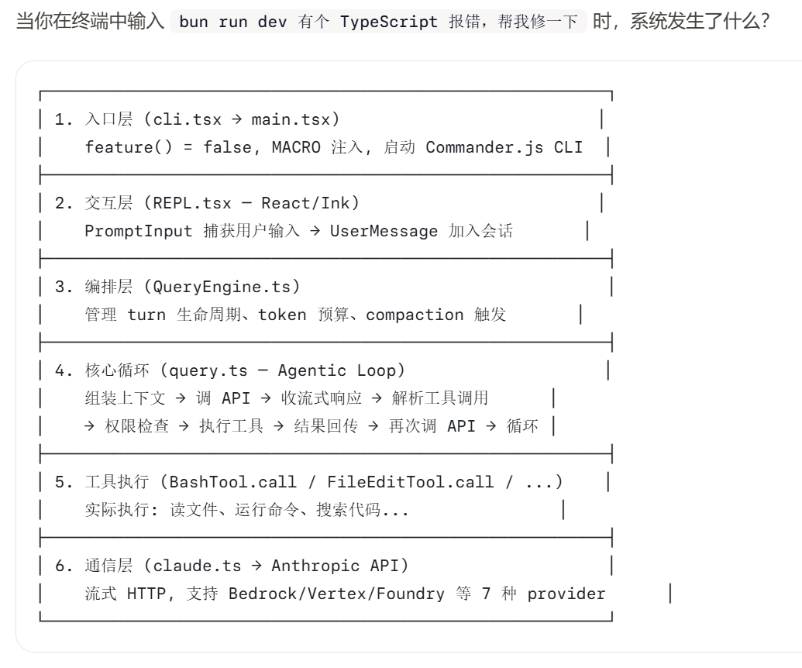

# 什么是 Claude Code

- Claude Code 是运行在终端中的 agentic coding system，直接在你的项目目录中读代码、改文件、跑命令、调试程序。了解它的技术定位、架构差异和核心能力。
- 一句话定义：Claude Code 是一个**运行在本地终端中的 agentic coding system**。它不是给建议的聊天机器人——它直接在你的项目目录中读代码、改文件、跑命令、调试程序，拥有完整的 shell 能力.

| 定位关键词             | 含义                                             |
| ---------------------- | ---------------------------------------------- |
| **Terminal-native**    | 原生 CLI 应用，不是 IDE 插件、不是 Web 界面、不是 API wrapper |
| **Agentic**            | AI 自主决策工具调用链，不是”一问一答”的聊天模式                |
| **Coding system**      | 面向软件工程全流程，不是通用问答工具                          |

## 端到端实例

具体到这个报错修复场景，一次典型的 agentic loop 可能包含多轮工具调用：

| Turn | AI 决策 | 工具调用 | 结果 |
| ---- | ------ | ------- | --- |
| 1    | 先看报错信息 | `Bash("bun run dev 2>&1 \| head -30")` | TypeScript 错误输出 |
| 2    | 定位到文件 | `Read("src/utils/foo.ts")` | 源代码内容 |
| 3    | 搜索相关类型定义 | `Grep("interface Foo", "src/")` | 类型定义位置 |
| 4    | 修复代码 | `FileEdit(old, new)` | 代码已修改 |
| 5    | 验证修复 | `Bash("bun run dev 2>&1 \| head -10")` | 编译通过 |

每一步都是 AI 自主决策的——它决定用哪个工具、传什么参数、何时停止。这就是 “agentic” 的含义。